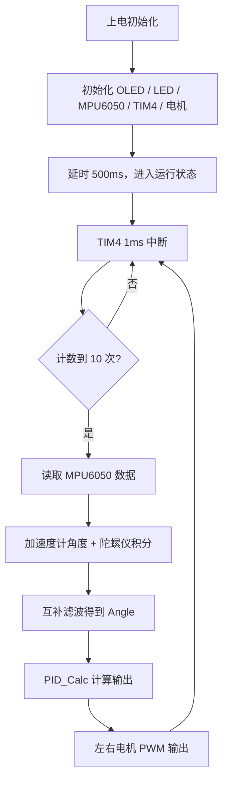

# 平衡小车工程说明

## 项目概述

本工程是基于 STM32F103 的两轮自平衡小车控制程序。当前版本采用 MPU6050 姿态估计、角度环 PID 控制和电机 PWM 输出，重点目标是让小车先稳定直立，再逐步优化振动和响应速度。

## 硬件资源分配

| 模块 | 外设/引脚 | 作用 |
| --- | --- | --- |
| MPU6050 | I2C2，PB10/SCL，PB11/SDA | 读取加速度计和陀螺仪数据 |
| 电机 PWM | TIM3 | 产生左右电机的 PWM 占空比 |
| 电机方向控制 | PB12、PB13、PB14、PB15 | 控制左右电机正反转方向 |
| 控制定时器 | TIM4 | 产生 1ms 中断节拍，执行闭环控制 |
| OLED 显示 | PB8/SCL，PB9/SDA | 显示调试信息和状态 |
| 指示灯 | PC13 | 当前作为运行状态指示灯 |
| 直立控制 | 软件算法 | 互补滤波 + 角度 PID |

说明：当前版本没有接入编码器闭环，主要控制量来自 MPU6050 的姿态角度。

## 主要算法

### 1. 姿态角估计

控制中断里先读取 MPU6050 原始数据，再把加速度计和陀螺仪的信息合起来：

- 加速度计负责提供“当前大概歪了多少”
- 陀螺仪负责提供“车身正在往哪边转、转得多快”
- 两者通过互补滤波融合，得到更稳定的角度值

核心思路可以理解为：

- 加速度计适合看长期趋势，但会抖
- 陀螺仪适合看短期变化，但会漂移
- 融合后，角度既不会太飘，也不会太迟钝

### 2. 角度环 PID

当前控制对象是“车身角度”，目标是让角度尽量接近直立点。

PID 输出可以简单理解成：

- P 项：车歪得越多，电机推得越大
- I 项：消除长期偏差
- D 项：抑制变化过快造成的振荡

当前工程里主要使用角度环 PID，电机输出范围限制在 `-100 ~ 100`，并带有最小起转补偿，用来克服电机静摩擦。

### 3. 控制节拍

TIM4 提供 1ms 中断节拍，程序不是每次中断都重新做完整姿态计算，而是每 10 次中断更新一次姿态和控制量，相当于约 10ms 执行一次完整闭环。

这样做的目的有两个：

- 减少 MPU6050 读取开销
- 保持控制循环节奏稳定

## 程序流程

## 关键调参点

- 如果小车“反应慢、扶不住”，优先增大 `PID_KP` 或 `PID_KD`
- 如果小车“左右来回抖”，优先减小 `PID_KP` 或 `PID_KD`
- 如果电机输出很小但轮子不转，增大 `PID_MIN_OUTPUT`
- 如果直立点偏左或偏右，调整 `PID_ZERO_OFFSET`
- 如果角度估计不稳，调整互补滤波和陀螺仪零漂修正

## 当前版本特点

- 以角度环为主，不做速度环闭环
- 通过互补滤波提升直立时的姿态稳定性
- 通过最小起转补偿提升电机起步能力
- 适合先调到“能立住”，再继续优化振动和细节响应

